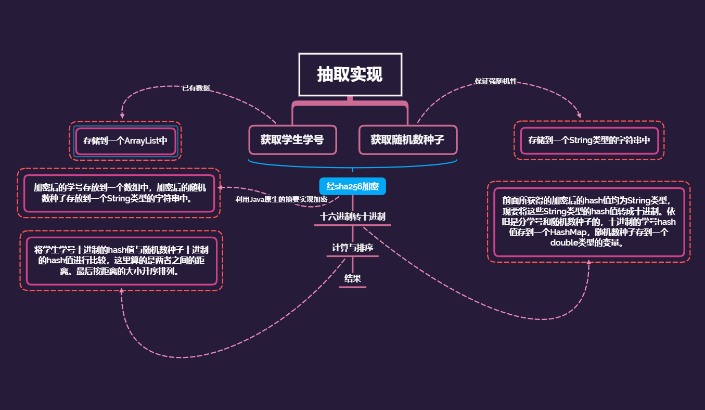

# Meeting_Lottery
> This is a simple project which aims at solving a problem that how to choose the spokesman of the class meeting.

## 1. 算法思想
参考于：[稚晖君](https://www.bilibili.com/video/BV1wT4y1G7vR/)

## 2. 算法流程：

